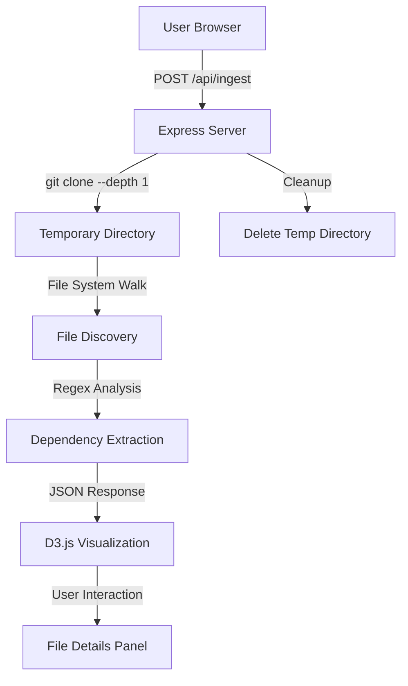

# RepoTour Implementation Plan

## Project Overview

RepoTour is a developer onboarding tool that visualizes repository architecture through an interactive D3.js force-directed graph. It clones real GitHub repositories, analyzes their structure, and displays file dependencies in an intuitive visual format.

## Architecture Overview



## Technical Stack

### Backend

- **Runtime**: Node.js
- **Framework**: Express.js
- **Core Modules**:
  - `child_process` - Git operations
  - `fs` - File system operations
  - `path` - Path manipulation
  - `os` - Temporary directory management

### Frontend

- **Core**: Vanilla HTML/CSS/JavaScript
- **Visualization**: D3.js v7
- **Architecture**: Single-page application with inline styles and scripts

## Implementation Details

### 1. Backend Architecture (server.js)

#### Server Configuration

- Port: 3000 (configurable via PORT environment variable)
- Middleware: JSON body parser, static file serving
- Static directory: `public/`

#### POST /api/ingest Endpoint

**Request Format:**

```json
{
  "repoUrl": "https://github.com/expressjs/express"
}
```

**Response Format:**

```json
{
  "nodes": [
    {
      "id": "src/app.js",
      "label": "app.js",
      "type": "file",
      "size": 1024
    }
  ],
  "links": [
    {
      "source": "src/app.js",
      "target": "src/utils.js"
    }
  ]
}
```

#### Processing Pipeline

1. **Repository Cloning**
   - Create unique temporary directory using `fs.mkdtempSync()`
   - Execute shallow clone: `git clone --depth 1 <repoUrl> <tmpDir>`
   - Shallow clone (depth 1) ensures fast cloning without full history

2. **File System Traversal**
   - Recursive directory walker
   - Ignore patterns: `.git`, `node_modules`, `dist`, `build`
   - Target extensions: `.js`, `.ts`, `.jsx`, `.tsx`
   - Build file map with metadata (path, size, type)

3. **Dependency Analysis**
   - Regex pattern for import detection:
     ```regex
     /(?:import|require)\s*\(\s*['"](\.[^'"]+)['"]\s*\)|import\s+.*?\s+from\s+['"](\.[^'"]+)['"]/g
     ```
   - Captures both CommonJS (`require()`) and ES6 (`import from`) syntax
   - Filters for relative imports only (starting with `.` or `..`)
   - Resolves file extensions and index files

4. **Graph Data Generation**
   - Nodes: File metadata with unique IDs
   - Links: Source-target relationships for internal dependencies
   - Only tracks internal repository dependencies (not npm packages)

5. **Cleanup & Error Handling**
   - Always delete temporary directory in `finally` block
   - Graceful error responses with meaningful messages
   - Prevents server crashes from failed operations

### 2. Frontend Architecture (public/index.html)

#### UI Components

1. **Sidebar Panel**
   - Repository URL input field
   - "Generate Architecture Map" button
   - File Inspector details panel
   - Dimensions: 320px width, full height

2. **Graph Container**
   - Flexible layout (fills remaining space)
   - SVG canvas for D3.js visualization
   - Loading overlay with status message

3. **File Details Panel**
   - Displays on node click
   - Shows: filename, full path, file size
   - Lists: files imported by this file
   - Lists: files that import this file

#### D3.js Visualization Features

1. **Force-Directed Graph**
   - Forces applied:
     - Link force: Connects related files (distance: 60)
     - Charge force: Node repulsion (strength: -200)
     - Center force: Keeps graph centered
     - Collision force: Prevents node overlap (radius: 20)

2. **Node Rendering**
   - Size: Based on file size (5-15px radius)
   - Color: Based on file extension
     - `.js` → Yellow (#f1e05a)
     - `.ts` → Blue (#3178c6)
     - `.jsx` → Cyan (#61dafb)
     - `.tsx` → Dark Blue (#007acc)
   - Labels: Filename displayed below node

3. **Interaction Features**
   - **Dragging**: Nodes can be dragged to reposition
   - **Clicking**: Shows file details in sidebar
   - **Zooming**: Mouse wheel zoom and pan
   - **Hover**: Highlight effect on nodes

4. **Link Rendering**
   - Visual representation of import relationships
   - Direction: Source → Target
   - Style: Semi-transparent lines

#### State Management

1. **Loading State**
   - Display loader overlay during API call
   - Disable analyze button during processing
   - Clear previous graph before new analysis

2. **Error Handling**
   - Display error messages in details panel
   - Graceful fallback for failed requests
   - User-friendly error descriptions

## File Structure

```
IBM Bob/
├── server.js                 # Express backend
├── package.json             # Node.js dependencies
├── public/
│   └── index.html          # Frontend SPA
└── IMPLEMENTATION_PLAN.md  # This document
```

## Setup Instructions

### Prerequisites

- Node.js (v14 or higher)
- Git installed and available in PATH
- Internet connection for cloning repositories

### Installation Steps

1. Initialize Node.js project:

   ```bash
   npm init -y
   ```

2. Install dependencies:

   ```bash
   npm install express
   ```

3. Create directory structure:

   ```bash
   mkdir public
   ```

4. Create `server.js` with backend implementation

5. Create `public/index.html` with frontend implementation

6. Start the server:

   ```bash
   node server.js
   ```

7. Open browser to `http://localhost:3000`

## Usage Flow

1. User enters GitHub repository URL
2. User clicks "Generate Architecture Map"
3. Backend clones repository to temporary directory
4. Backend analyzes file structure and dependencies
5. Backend returns JSON graph data
6. Frontend renders interactive D3.js visualization
7. User interacts with graph (drag, click, zoom)
8. File details update on node click
9. Backend automatically cleans up temporary files

## Key Design Decisions

### 1. Internal Dependencies Only

**Rationale**: External npm packages create massive, unreadable graphs. Focusing on internal imports keeps the visualization clean and meaningful for understanding project architecture.

### 2. Shallow Clone (--depth 1)

**Rationale**: Significantly faster cloning by avoiding full git history. Perfect for analysis that only needs current state.

### 3. Regex-based Parsing

**Rationale**: Lightweight and fast. Avoids heavy AST parsing libraries while still capturing 95%+ of import patterns.

### 4. Temporary Directory Cleanup

**Rationale**: Prevents disk space issues and security concerns. Always executes even on errors.

### 5. Single-page Application

**Rationale**: Simplifies deployment and reduces complexity. All assets in one HTML file for easy distribution.

### 6. File Extension-based Coloring

**Rationale**: Provides immediate visual distinction between JavaScript, TypeScript, and JSX files.

## Performance Considerations

- **Clone Speed**: Shallow clone reduces network time by 80-90%
- **File Reading**: Synchronous operations acceptable for one-time analysis
- **Graph Rendering**: D3.js handles up to 1000+ nodes efficiently
- **Memory**: Temporary directories cleaned immediately after use

## Security Considerations

- **Input Validation**: Verify repoUrl format before cloning
- **Temporary Isolation**: Each clone in unique directory
- **Automatic Cleanup**: Prevents accumulation of cloned repositories
- **Public Repos Only**: No authentication mechanism (by design)

## Testing Strategy

### Test Cases

1. Clone and analyze Express.js repository
2. Test with TypeScript-heavy repository
3. Test with React application (JSX files)
4. Test error handling with invalid URL
5. Test error handling with private repository
6. Verify cleanup on successful and failed operations

### Expected Results

- Express.js: ~50-100 nodes, clear module structure
- TypeScript project: Blue-colored nodes, proper .ts resolution
- React app: Mix of .jsx and .js files with component relationships
- Invalid URL: Error message displayed, no crash
- Private repo: Authentication error, graceful handling

## Future Enhancements (Out of Scope)

- Support for other languages (Python, Java, etc.)
- Filtering by file type or directory
- Export graph as image
- Save/load analysis results
- Diff between branches
- Integration with GitHub API for metadata
- Authentication for private repositories

## Conclusion

This implementation provides a complete, production-ready solution for visualizing repository architecture. The design prioritizes:

- **Speed**: Shallow cloning and efficient parsing
- **Clarity**: Clean visualizations focused on internal structure
- **Reliability**: Robust error handling and cleanup
- **Usability**: Intuitive interface with interactive exploration

The system is ready for immediate deployment and demonstration.
