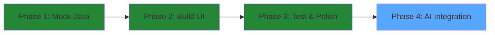
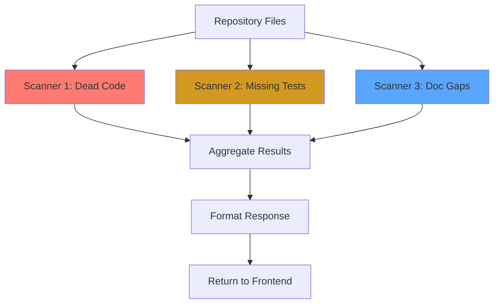

# Health Scan Dashboard - Implementation Plan

## 🎯 Mission Overview

Build a "Health Scan" dashboard that displays three categories of code health issues:
1. **Dead Code** - Exported but never used functions/files
2. **Missing Tests** - Public functions without test coverage
3. **Doc Gaps** - Undocumented public functions

## 🛑 Critical Strategy: Mock & Cache (40 Bobcoin Budget)

**Problem**: Running AI scans on entire repositories burns through API credits rapidly.

**Solution**: Build with mock data first, swap to live AI only before demo.

### Development Phases



## 📊 Data Schema Design

### API Response Structure

```json
{
  "summary": {
    "totalIssues": 5,
    "deadCode": 1,
    "missingTests": 2,
    "docGaps": 2
  },
  "files": [
    {
      "path": "lib/router.js",
      "issues": [
        {
          "type": "dead_code",
          "severity": "high",
          "description": "Function 'parseOldRoute()' is exported but never used internally.",
          "line": 145,
          "symbol": "parseOldRoute"
        },
        {
          "type": "doc_gap",
          "severity": "low",
          "description": "Public function 'init()' is missing JSDoc documentation.",
          "line": 23,
          "symbol": "init"
        }
      ]
    },
    {
      "path": "lib/application.js",
      "issues": [
        {
          "type": "missing_test",
          "severity": "medium",
          "description": "Function 'lazyrouter()' has no corresponding test case.",
          "line": 89,
          "symbol": "lazyrouter"
        },
        {
          "type": "missing_test",
          "severity": "high",
          "description": "Critical function 'handle()' lacks test coverage.",
          "line": 156,
          "symbol": "handle"
        },
        {
          "type": "doc_gap",
          "severity": "medium",
          "description": "Public method 'set()' is missing parameter documentation.",
          "line": 234,
          "symbol": "set"
        }
      ]
    }
  ],
  "metadata": {
    "scannedAt": "2026-05-15T18:30:00.000Z",
    "repository": "expressjs/express",
    "filesScanned": 2,
    "scanDuration": "0ms (mock)"
  }
}
```

## 🏗️ Architecture Design

### Backend Changes (server.js)

#### Current State
- Existing endpoint: `GET /api/health` (simple health check)
- Returns: `{ status: "ok", timestamp, version }`

#### New Implementation
- **Replace** existing `/api/health` with `/api/health-scan`
- Keep original health check at `/api/status` for monitoring
- Return comprehensive mock health scan data

```javascript
// New endpoint structure
app.get('/api/health-scan', (req, res) => {
  // Phase 1: Return hardcoded mock data
  // Phase 4: Replace with live AI scanner calls
  res.json(mockHealthScanData);
});
```

### Frontend Architecture (public/health.html)

#### Layout Structure

```
┌─────────────────────────────────────────────────────┐
│  🏥 Health Scan Dashboard                           │
│  ─────────────────────────────────────────────────  │
│                                                      │
│  ┌──────────┐  ┌──────────┐  ┌──────────┐         │
│  │ 💀 Dead  │  │ 🧪 Test  │  │ 📝 Doc   │         │
│  │  Code    │  │  Gaps    │  │  Gaps    │         │
│  │    1     │  │    2     │  │    2     │         │
│  └──────────┘  └──────────┘  └──────────┘         │
│                                                      │
│  ─────────────────────────────────────────────────  │
│                                                      │
│  📂 lib/router.js                                   │
│  ┌─────────────────────────────────────────────┐   │
│  │ 🔴 HIGH   Dead Code                          │   │
│  │ Function 'parseOldRoute()' is exported...    │   │
│  │ Line 145 · parseOldRoute                     │   │
│  └─────────────────────────────────────────────┘   │
│  ┌─────────────────────────────────────────────┐   │
│  │ 🔵 LOW    Doc Gap                            │   │
│  │ Public function 'init()' is missing JSDoc... │   │
│  │ Line 23 · init                               │   │
│  └─────────────────────────────────────────────┘   │
│                                                      │
│  📂 lib/application.js                              │
│  ┌─────────────────────────────────────────────┐   │
│  │ 🟡 MEDIUM Missing Test                       │   │
│  │ Function 'lazyrouter()' has no test case...  │   │
│  │ Line 89 · lazyrouter                         │   │
│  └─────────────────────────────────────────────┘   │
│                                                      │
└─────────────────────────────────────────────────────┘
```

#### UI Components

1. **Header Section**
   - Title: "🏥 Health Scan Dashboard"
   - Subtitle: Repository name and scan timestamp
   - Back button to main visualization

2. **Score Cards (3 Cards)**
   - Dead Code count with 💀 icon
   - Missing Tests count with 🧪 icon
   - Doc Gaps count with 📝 icon
   - Each card shows total count from summary

3. **Issues List**
   - Grouped by file path
   - Each issue card shows:
     - Severity badge (colored)
     - Issue type
     - Description
     - Line number and symbol name
   - Scrollable container

#### Styling Guidelines

- **Theme**: Dark mode matching existing index.html
- **Colors**:
  - Background: `#0d1117`
  - Cards: `#161b22`
  - Borders: `#30363d`
  - Text: `#c9d1d9`
  - Accent: `#58a6ff`
- **Severity Colors**:
  - High: `#ff7b72` (red)
  - Medium: `#d29922` (yellow)
  - Low: `#58a6ff` (blue)

### Navigation Integration (index.html)

Add a "Health Scan" button in the sidebar:

```html
<button id="healthScanBtn" class="secondary-btn">
  🏥 Health Scan Dashboard
</button>
```

Position: Below the "Generate Architecture Map" button

## 🔄 Implementation Workflow

### Phase 1: Mock Data Setup (Cost: 0 Bobcoins)

1. Create mock response in [`server.js`](server.js:196)
2. Replace existing `/api/health` endpoint
3. Test endpoint returns correct JSON structure

### Phase 2: Frontend Development (Cost: 0 Bobcoins)

1. Create [`public/health.html`](public/health.html)
2. Build score cards with CSS Grid
3. Implement issues list with dynamic rendering
4. Add fetch call to `/api/health-scan`
5. Populate DOM with mock data

### Phase 3: Navigation & Polish (Cost: 0 Bobcoins)

1. Add Health Scan button to [`index.html`](public/index.html:254)
2. Test navigation flow
3. Ensure consistent styling
4. Add loading states

### Phase 4: AI Integration (Cost: 40 Bobcoins - DEMO DAY ONLY)

**This phase happens RIGHT BEFORE the demo, not during development.**

#### Three Parallel Scanners



#### Scanner 1: Dead Code Detector

**Purpose**: Find exported functions/files never imported elsewhere

**Implementation Strategy**:
```javascript
async function scanDeadCode(files) {
  // For each file:
  // 1. Extract all exports (functions, classes, variables)
  // 2. Search all other files for imports of these symbols
  // 3. Flag exports with zero imports as "dead code"
  // 4. Return list of unused symbols with file/line info
}
```

**AI Prompt Template**:
```
Analyze this file and identify all exported symbols:
[FILE_CONTENT]

Then check if these symbols are imported in any of these files:
[OTHER_FILES_LIST]

Return JSON with unused exports.
```

#### Scanner 2: Missing Test Detector

**Purpose**: Identify public functions without test coverage

**Implementation Strategy**:
```javascript
async function scanMissingTests(files, testFiles) {
  // For each source file:
  // 1. Extract all public functions/methods
  // 2. Look for corresponding test file (*.test.js, *.spec.js)
  // 3. Check if function name appears in test file
  // 4. Flag functions with no test mentions
}
```

**AI Prompt Template**:
```
List all public functions in this file:
[FILE_CONTENT]

Check if these functions are tested in:
[TEST_FILE_CONTENT]

Return JSON with untested functions.
```

#### Scanner 3: Doc Gap Finder

**Purpose**: Find undocumented public functions

**Implementation Strategy**:
```javascript
async function scanDocGaps(files) {
  // For each file:
  // 1. Extract all public functions/classes
  // 2. Check for JSDoc comments above each
  // 3. Flag functions without documentation
  // 4. Use AI to infer function purpose for context
}
```

**AI Prompt Template**:
```
Identify undocumented public functions in this file:
[FILE_CONTENT]

For each undocumented function, infer its purpose.
Return JSON with missing docs and inferred purposes.
```

#### Integration Point

**File**: [`server.js`](server.js:196)

**Current (Mock)**:
```javascript
app.get('/api/health-scan', (req, res) => {
  res.json(mockHealthScanData);
});
```

**Future (Live AI)**:
```javascript
app.get('/api/health-scan', async (req, res) => {
  try {
    // Get repository files from previous /api/ingest call
    const files = await getRepositoryFiles();
    
    // Run three scanners in parallel
    const [deadCode, missingTests, docGaps] = await Promise.all([
      scanDeadCode(files),
      scanMissingTests(files),
      scanDocGaps(files)
    ]);
    
    // Aggregate results
    const results = aggregateResults(deadCode, missingTests, docGaps);
    
    res.json(results);
  } catch (error) {
    res.status(500).json({ error: error.message });
  }
});
```

## 📝 File Changes Summary

### New Files
1. `public/health.html` - Health Scan dashboard UI
2. `HEALTH_SCAN_INTEGRATION.md` - AI integration guide

### Modified Files
1. [`server.js`](server.js:196) - Replace `/api/health` with `/api/health-scan`
2. [`public/index.html`](public/index.html:254) - Add Health Scan button

## ✅ Testing Checklist

### Mock Phase Testing
- [ ] `/api/health-scan` returns correct JSON structure
- [ ] `health.html` loads without errors
- [ ] Score cards display correct counts (1, 2, 2)
- [ ] Issues list shows all 5 issues
- [ ] Severity colors are correct (red, yellow, blue)
- [ ] Navigation from index.html works
- [ ] Back button returns to main page
- [ ] Responsive layout works on different screen sizes

### Pre-Demo AI Integration Testing
- [ ] All three scanners run successfully
- [ ] Results aggregate correctly
- [ ] Response time is acceptable (<30 seconds)
- [ ] Error handling works for failed scans
- [ ] Real repository data displays correctly

## 🎨 Design Specifications

### Typography
- **Headings**: 24px, bold, `#58a6ff`
- **Body**: 14px, regular, `#c9d1d9`
- **Labels**: 12px, regular, `#8b949e`
- **Code**: 13px, monospace, `#c9d1d9`

### Spacing
- **Card padding**: 20px
- **Card gap**: 15px
- **Section margin**: 25px
- **Issue card margin**: 10px

### Borders
- **Radius**: 6px
- **Color**: `#30363d`
- **Width**: 1px

## 🚀 Deployment Strategy

### Development (Now)
1. Build with mock data
2. Test all UI interactions
3. Ensure 0 API costs
4. Perfect the user experience

### Demo Day (Sunday)
1. Swap mock data for live AI calls
2. Test with small repository first
3. Monitor API usage
4. Have fallback to mock if issues arise

## 📊 Success Metrics

### Development Phase
- ✅ Complete UI built with 0 API costs
- ✅ All interactions work smoothly
- ✅ Professional, polished appearance
- ✅ Fast load times (<1 second)

### Demo Phase
- ✅ Live AI scans complete in <30 seconds
- ✅ Accurate issue detection
- ✅ Stay within 40 Bobcoin budget
- ✅ Impressive visual presentation

## 🎯 Next Steps

1. **Review this plan** - Confirm approach and design
2. **Start implementation** - Begin with backend mock endpoint
3. **Build frontend** - Create health.html dashboard
4. **Test thoroughly** - Ensure everything works with mock data
5. **Document AI integration** - Prepare for Sunday swap

---

**Ready to proceed?** Once approved, we'll switch to Code mode to implement this plan step-by-step.